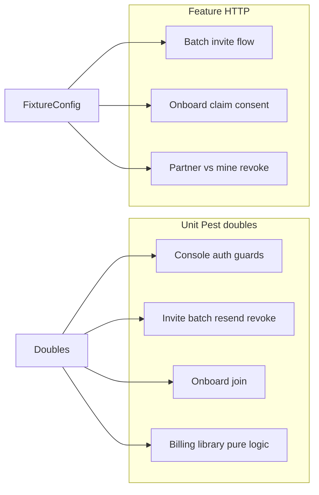

# Sponsorship & Partner Tests Plan

## Scope

**In scope:** public partner sponsorship product surface only — console `/sponsorships/*`, beneficiary `/sponsorships/mine*`, hosted `/partner/onboard` + `/partner/join`, models under [`catalog/model/partner/`](catalog/model/partner/), libraries [`partner_sponsorship_billing.php`](system/library/partner_sponsorship_billing.php) + [`partner_invitation_email.php`](system/library/partner_invitation_email.php).

**Out of scope:** admin `partner/program` CRUD, CSC OpenAPI `flow=partner` signing, document `sponsored_invitation` signing entitlements, unimplemented reseller draft.

**Default:** no production code changes (guideline §11). Extend [`tests_config.php`](tests/tests_config.php) + Support helpers only when Feature fixtures are required.

Reference: [`tests/strategies/testing-guidelines.md`](tests/strategies/testing-guidelines.md), gap rows P0 Sponsorships / Partner in [`tests/strategies/test-gap-plan.md`](tests/strategies/test-gap-plan.md). Pattern twin: Referrals (`ReferralsTestDoubles` + Feature helpers).

## Conventions (every package)

- Pest `test()` with PHPDoc **Prerequisites + numbered Steps** immediately above `test(` (guideline §13).
- Titles: `Sponsorships - …` / `Partner - …` (product prefix + em dash).
- Unit: no real DB / Stripe / EmailQueue — stubs only.
- Feature: arrange only via public HTTP + pre-seeded config keys; skip if fixture missing (guideline §12). Prefer API cleanup in `finally` when revoke/resend endpoints exist.
- Do not mix unit and feature styles in one file.

## Shared foundation (WP0 — run first)

Create doubles and helpers before scenario files:

| Artifact                                                                                                                               | Role                                                                                                                                                                                                 |
| -------------------------------------------------------------------------------------------------------------------------------------- | ---------------------------------------------------------------------------------------------------------------------------------------------------------------------------------------------------- |
| [`tests/Unit/Api/Sponsorships/_support/SponsorshipsTestDoubles.php`](tests/Unit/Api/Sponsorships/_support/SponsorshipsTestDoubles.php) | Testable controllers for all 9 sponsorship routes; customer/company/admin stubs; program/link/sponsorship model stubs; load/registry helpers mirroring `billing_registry` / `ti_registry_with_model` |
| [`tests/Unit/Api/Partner/_support/PartnerTestDoubles.php`](tests/Unit/Api/Partner/_support/PartnerTestDoubles.php)                     | Testable `onboard` + `join`; token/link stubs; rate-limit stubs                                                                                                                                      |
| [`tests/Support/SponsorshipsApiHelper.php`](tests/Support/SponsorshipsApiHelper.php)                                                   | URLs, `apiRequest` wrappers, config guards (`assertSponsorProgramOrSkip`), error join helpers                                                                                                        |
| [`tests/Support/PartnerApiHelper.php`](tests/Support/PartnerApiHelper.php)                                                             | Onboard/join URL builders + skip guards                                                                                                                                                              |
| `tests_config.php` keys (Feature only)                                                                                                 | e.g. sponsor company admin path for `TEST_USER_1`, `SPONSORSHIP_TEST_PROGRAM_UUID` / `program_code` for an **already-active** program (admin-created; no public create API)                          |

---

## Unit packages (primary depth)

### WP1 — Console auth & program surface — `unit-test-writer`

**Files:** `SponsorshipsAuthTest.php`, `SponsorshipsProgramTest.php`, `SponsorshipsOverviewTest.php`, `SponsorshipsEmailPreviewTest.php`

Cover matrix (dataset/`->with` like Billing guards):

- Unauthenticated → **401**, no model load
- No company context → `company_context_required` **403**
- Non-admin company role → `admin_role_required` **403**
- Missing route permission → `access_denied` **403** before model
- No program for company → **404** `program_not_found` (or controller’s actual code)
- `program` PATCH: branding/email_copy validation reject (**400**); commercial fields not writable via console
- `overview` / `email_preview` success shape with stubbed program (`data.*` keys)

### WP2 — Invitations (single, batch, resend, revoke) — `unit-test-writer`

**Files:** `SponsorshipsInvitationsTest.php`, `SponsorshipsBatchInviteTest.php`, `SponsorshipsResendTest.php`, `SponsorshipsRevokeTest.php`

Depth targets:

- Single invite: distribution `simplifi_email` vs `partner_delivered` payload validation; `program_not_active` **409**; model `link_already_exists` mapped; success returns `hosted_url` only for partner_delivered
- Batch: `confirm=false` validate-only (no create/billing calls); `confirm=true` all-or-nothing → **422** when any row bad; max-rows reject; stub `validateRows` outcomes via model/link stubs
- Resend: queue-failure path; not-invited status **409**; token rotate not committed on queue fail (assert model method call order via spy stubs)
- Partner revoke: missing `link_uuid` → `link_uuid_required`; success calls revoke + billing hook stub; double-revoke / wrong uuid mapping

### WP3 — Partner onboard + join — `unit-test-writer`

**Files:** `PartnerOnboardTest.php`, `PartnerJoinTest.php`

- Preview/status: invalid/expired token mapping; anonymous allowed
- Claim/consent: unauthenticated **401**; consent-before-claim reject; already-active / revoked branches
- Status `stepStateForLink` mapping through controller response
- Join: missing `external_ref`; rate-limited **429**; uniform `link_not_found` (no enumeration leak); success mints token URL from stub

### WP4 — Beneficiary mine + libraries — `unit-test-writer`

**Files:** `SponsorshipsMineTest.php`, `PartnerSponsorshipBillingTest.php`, `PartnerInvitationEmailTest.php`, optional `PartnerCustomerLinkValidatorsTest.php`

- `mine` / `mine/revoke`: auth; `link_uuid_required`; foreign link → not-found; revoke triggers `afterRevocation` stub
- **Billing library (in-depth, no Stripe SDK):**
  - `grantKeyPrefix` / `grantQuantity` static cases (period × interval)
  - `afterRevocation` no-op when `billed_at` empty; clears billed only after successful decrement stub
  - `billInvitations` skips already-billed link ids
  - `afterActivation` / period key idempotency with sponsorship model stub
- **Email:** `composeCopy` / display-name precedence from branding JSON (pure)
- **Model validators without DB:** `normalizeEmail`, `isValidInviteEmail`, `isValidExternalRef`, `isRevokedStatus`, `stepStateForLink` with fabricated rows

Model lifecycle that is SQL-heavy (`createOrRefreshLink`, activate, purge) stays covered by existing CLI smoke [`internal/tools/2026-08-27_partner_sponsorship_smoke.php`](internal/tools/2026-08-27_partner_sponsorship_smoke.php) + Feature; do not open real DB from Unit.

---

## Feature packages (secondary)

Requires WP0 config keys. Skip entire suites if sponsor program fixture absent.

### WP5 — Feature flows — `feature-test-writer`

| File                                                                  | Scenario                                                                                                               |
| --------------------------------------------------------------------- | ---------------------------------------------------------------------------------------------------------------------- |
| `tests/Feature/Api/Sponsorships/SponsorshipsBatchInviteFlowTest.php`  | Admin bearer → `confirm=false` report → `confirm=true` creates; bad row all-or-nothing; partner_delivered `hosted_url` |
| `tests/Feature/Api/Partner/PartnerOnboardFlowTest.php`                | Invite (API) → preview → claim → consent; assert status steps; skip if cert/activation cannot complete in env          |
| `tests/Feature/Api/Sponsorships/SponsorshipsRevokeParityFlowTest.php` | Partner revoke vs `mine/revoke`; second revoke fails; roster/`mine` reflect status                                     |
| Optional thin: `SponsorshipsConsoleReadFlowTest.php`                  | GET overview/program as company admin vs non-admin **403**                                                             |

Parity note (guideline / Bugbot theme): single invite vs batch must match refresh/revive and `per_invitation` billing triggers — assert same error codes and response keys where both paths exist.

---

## Orchestration for subagents

| Order | Subagent                       | Work                                                                                                        |
| ----- | ------------------------------ | ----------------------------------------------------------------------------------------------------------- |
| 1     | `unit-test-writer`             | **WP0 + WP1** (doubles + auth/program) — unblock everything                                                 |
| 2     | `unit-test-writer` ×3 parallel | **WP2**, **WP3**, **WP4** (no overlapping files)                                                            |
| 3     | `feature-test-writer`          | **WP5** after WP0 helpers + config keys exist                                                               |
| 4     | `test-reviewer`                | All new `tests/Unit/Api/{Sponsorships,Partner}` + Feature files — weak asserts, missing docblocks, DB leaks |
| 5     | `test-runner`                  | `pest` on new paths; fix test bugs only                                                                     |

Prompt constraints for writers: follow `testing-guidelines.md`; mirror Referrals/Billing harness style; titles + Prerequisites/Steps; no controller/model edits under `public/`.

## Acceptance

- New Unit suites green without Stripe/Mailgun/DB.
- Feature suites either green against seeded program or cleanly skipped with documented Prerequisites.
- Authz and batch all-or-nothing covered in Unit at minimum (closes gap-plan items #15 / #37 / Partner P0).
- No `sponsored_invitation` / CSC partner-flow tests mixed in.

## Explicit non-goals this wave

- Extending the CLI smoke (already exists; keep as regression for SQL lifecycle).
- Admin program CRUD Pest tests.
- Live Stripe quantity mutations in Feature (assert HTTP + status; billing money paths remain Unit + smoke).
