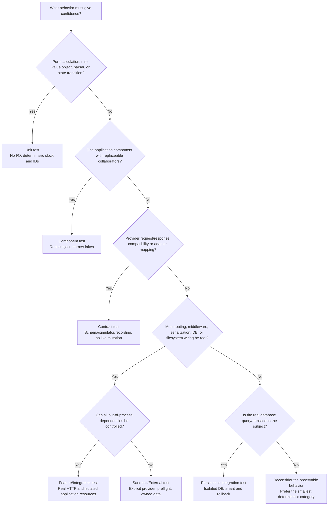

# Testing Strategy Review

**Status:** Proposed review and replacement guidance

**Review date:** 2026-08-26

**Scope:** `/var/www/api01.dev.simplifi.ro/tests` plus the application-side test runner under `/var/www/api01.dev.simplifi.ro/public/system/library/test` and `system/config/test_run_config.php`

**Evidence cutoff:** 2026-08-26

**Reviewed revisions:** tests repository `b4b3115`; application repository `033ab631`

This report evaluates the strategy that the repository actually executes, not only the strategy described in documents. It does not modify production code, tests, runner configuration, or the current guidelines.

Priority and effort labels used throughout:

- **Priority:** Critical, High, Medium, Low.
- **Effort:** Small (up to a few engineer-days), Medium (roughly one to two focused weeks), Large (multi-week or cross-team change).

## 1. Executive summary

The suite has a solid risk-oriented foundation, a substantial body of Pest tests, good recent controller-boundary examples, and unusually thoughtful coverage analysis. It is not yet a dependable release signal.

The central problem is not the number of tests. It is that the normal Feature path mixes application integration, mutable shared sandbox data, real identity, email, PDF, billing, signing, and PKI dependencies while permitting runtime skips and broad outcomes when those dependencies or fixtures are unsuitable. At the same time, the scheduled runner has reported the same nine failures and two skips every day from 2026-08-14 through 2026-08-25. A persistently red baseline plus conditional skips makes a new regression difficult to distinguish from accepted noise.

The most important changes are:

1. Restore a green, owned baseline. No recurring failure should remain accepted in the main deterministic suite.
2. Separate deterministic application tests from sandbox/external-system tests. External availability must not control the main pull-request signal.
3. Replace per-test dynamic skips and broad accepted statuses with explicit suite eligibility and exact contract assertions.
4. Give each run isolated data and identities, with ownership-aware cleanup. The present shared users, active-role mutation, fixed seat slot, and persistent records prevent reliable parallel execution.
5. Record the application and tests revisions for every run and enforce their compatibility. The application and tests are independent repositories and can drift.
6. Make one strategy document authoritative. Mark older plans as historical or superseded because they currently give conflicting advice about external services, direct database setup, exact messages, and suite scope.
7. Treat coverage as a diagnostic by component and risk, not as a global percentage gate. The existing 34.21% controller line figure is not a valid measure of end-to-end protection.

### Overall assessment

| Dimension             | Assessment                 | Reason                                                                                                                                                     |
| --------------------- | -------------------------- | ---------------------------------------------------------------------------------------------------------------------------------------------------------- |
| Test intent           | Strong                     | Security, tenant boundaries, side-effect prevention, and workflow behavior receive explicit attention.                                                     |
| Test architecture     | Mixed                      | Recent controller tests are focused, but large doubles, production-named stubs, copied controllers, globals, and real filesystem paths create coupling.    |
| Feature reliability   | Weak                       | Runtime skips, shared data, server-side active-role changes, and external dependencies allow false-green or environment-dependent outcomes.                |
| Isolation and cleanup | Weak                       | A few flows clean up carefully, but many create durable documents, templates, companies, invitations, and campaigns without ownership-based teardown.      |
| Performance           | Needs work                 | Every Feature API scenario performs a global two-user role reset, and cron starts a new Pest process for each configured folder.                           |
| Coverage practice     | Promising but incomplete   | The coverage strategy correctly documents attribution limits, but reports are manual, line-oriented, and not comparable to Feature protection.             |
| Automation            | Operational but not gating | Daily cron has history, JUnit parsing, timeouts, overlap prevention, and notifications; no repository PR workflow was found, and the baseline remains red. |
| Documentation         | Rich but contradictory     | Useful guidance exists, but stale plans and guidelines disagree and have no authority or lifecycle markers.                                                |

### Direct answers to the key questions

| Question                                                | Answer                                                                                                                                                                                                                                                                                                                     |
| ------------------------------------------------------- | -------------------------------------------------------------------------------------------------------------------------------------------------------------------------------------------------------------------------------------------------------------------------------------------------------------------------- |
| When should a test be Unit versus Feature/Integration?  | Use Unit for deterministic logic or a component boundary with all out-of-process collaborators replaced. Use Feature/Integration only when the real HTTP stack, routing, persistence, serialization, or framework wiring is the behavior under test. Real third-party systems belong in a separate Sandbox/External suite. |
| Is the current balance appropriate?                     | Not as a quality signal. The count is heavily Unit-oriented (962 Unit vs 187 Feature scenarios), but many Unit tests are controller-component tests and the smaller Feature suite carries too many responsibilities and dependencies. Improve classification and depth, not raw ratio.                                     |
| Are Feature tests isolated enough?                      | No. They share identities, active-role state, fixed fixture UUIDs, mutable sandbox records, and static flow state; many created records are not removed.                                                                                                                                                                   |
| Are tests coupled to implementation details?            | Some are. Exact model-call expectations are useful for side-effect boundaries, but production-named test classes, copied controller code, large doubles, globals, and exact collaborator choreography make refactors unnecessarily expensive.                                                                              |
| Is fixture setup duplicated or expensive?               | Yes. Global role reset and repeated real authentication dominate Feature setup; ad hoc payload construction and shared helper mini-frameworks coexist because there is no factory/builder convention.                                                                                                                      |
| Are all external integrations safe in the normal suite? | No. Identity, email queue, PDF/billing, signing, and PKI/CRL behavior can participate in normal Feature execution or determine skips.                                                                                                                                                                                      |
| Do names describe behavior and intent?                  | Recent workflow titles generally do. Older Unit titles and mixed punctuation are less consistent; folder and helper taxonomy is also inconsistent.                                                                                                                                                                         |
| Are statuses and messages asserted appropriately?       | Unevenly. Stable machine codes are asserted in several areas, but some tests assert exact human prose, some only assert non-success, and some accept multiple statuses.                                                                                                                                                    |
| What slows the suite?                                   | Repeated Keycloak authentication and role switching, a global two-user reset before every Feature API scenario, folder-per-process cron execution, polling/sleeps, broad bootstrap, real I/O, and large coupled helpers.                                                                                                   |
| Where is over-abstraction present?                      | The 1,781-line CRL helper, 538-line signing helper, broad billing doubles, static flow managers, and production-named stubs hide scenario state and create their own internal framework.                                                                                                                                   |
| Which helpers should be reused?                         | Stateless transport clients, authenticated request construction, stable response-envelope expectations, deterministic builders, and narrowly scoped fake adapters. Scenario decisions, skip/fail policy, mutable shared state, and business branching should remain visible in the test.                                   |
| How should coverage differ by component?                | Critical domain rules and utilities need high branch and invariant coverage; controllers need representative route/auth/status/envelope coverage; persistence needs tenant/query/idempotency integration checks; adapters need contract/failure mapping tests; external SDK glue should not be chased for line percentage. |
| Which paths need better coverage?                       | Tenant and authorization denials, billing entitlement/seat transitions, signing state transitions and failure compensation, idempotency, retry boundaries, cleanup failures, persistence filters, and adapter error mapping deserve priority.                                                                              |
| What should be reviewed immediately vs later?           | Immediately restore signal, split external suites, stop dynamic skips, reconcile runner targets, and record revisions. Next improve data isolation, helper design, contracts, and coverage inventory. Longer term introduce service/adaptor seams, parallel-safe identities, and repository compatibility enforcement.     |

## 2. Current-state summary

### Review method and limits

The review used:

- static inventory and pattern analysis of all test files, support code, strategy documents, `composer.json`, `phpunit.xml`, `Pest.php`, and configuration;
- inspection of the application-side cron and execution services;
- read-only inspection of the live development runner configuration and recent run history on 2026-08-26;
- the checked-in coverage baselines and locally generated HTML coverage reports.

The full suite was not re-run for this review. Doing so would invoke shared sandbox identities and mutable external workflows, which is one of the risks under review. The latest scheduled result is therefore used as the most recent execution evidence, not as validation of the current tests revision: the latest cron run was 2026-08-25, while tests revision `b4b3115` was committed on 2026-08-26 and added substantial Unit coverage. Counts below are static counts of literal Pest `test(...)`/`it(...)` declarations; generated dataset cases can produce different runtime totals.

### Inventory

| Item                      | Observed state                                                                                                                                        |
| ------------------------- | ----------------------------------------------------------------------------------------------------------------------------------------------------- |
| Framework                 | Pest on PHPUnit; no classic `test*` PHPUnit methods were found.                                                                                       |
| Base test case            | `TestCase.php` is an empty extension and is not enabled in `Pest.php`; shared behavior currently comes from functional Pest hooks and helpers.        |
| Unit tests                | 155 `*Test.php` files, 962 literal scenarios, approximately 30,485 lines.                                                                             |
| Feature tests             | 41 `*Test.php` files, 187 literal scenarios, approximately 6,802 lines.                                                                               |
| Scenario mix              | About 84% Unit and 16% Feature by literal declarations. This is taxonomy, not proof of test depth.                                                    |
| Required immediate PHPDoc | Present for 542/962 Unit scenarios and 181/187 Feature scenarios.                                                                                     |
| Feature skip surface      | 68 `markTestSkipped` call sites across 40 of 41 Feature test files. Some are suite flags; many are runtime prerequisite or service-failure decisions. |
| Waiting                   | Eight `sleep`/`usleep` call sites in Feature/Support, including long CRL polling.                                                                     |
| Time/random naming        | 49 `gmdate`, `random_bytes`, `mt_rand`, or `uniqid` calls in Feature/Support.                                                                         |
| Test support code         | Roughly 4,599 lines under `Support/`; `CertificateCrlFlowHelper.php` alone is 1,781 lines.                                                            |
| Root test configuration   | `phpunit.xml` defines Unit and Feature suites only; it has no coverage source configuration or groups.                                                |
| Composer command          | `composer test` delegates to Pest with no fast/slow or deterministic/external matrix.                                                                 |
| CI                        | No repository-hosted CI workflow was found. Daily application cron is the only observed automated full-run mechanism.                                 |
| Repositories              | Tests and application are separate Git repositories with independent revisions and no enforced pairing.                                               |

### What “Unit” and “Feature” currently mean

The current guidelines define only two choices:

- Unit: controller logic without database state, external services, or filesystem uploads.
- Feature/Integration: real HTTP endpoints with real database and filesystem behavior.

The implementation is more varied than that definition:

| Actual pattern                                     | Current location           | More accurate classification                          |
| -------------------------------------------------- | -------------------------- | ----------------------------------------------------- |
| Pure validation or utility behavior                | `Unit/`                    | Unit                                                  |
| Controller invoked with stubbed models/globals     | `Unit/Api/`                | Component/controller test                             |
| Controller source rewritten into `/tmp`            | `Unit/Api/Csc/` support    | Specialized component test, with coverage limitations |
| Real HTTP + application DB/filesystem              | `Feature/Api/`             | Feature/integration                                   |
| Real HTTP + Keycloak/email/PDF/billing/signing/PKI | `Feature/`                 | Sandbox/external end-to-end                           |
| CRL polling and certificate lifecycle              | `Feature/Api/Certificate/` | Long-running external/sandbox workflow                |

This missing middle is why “Unit” contains large application components while “Feature” has become responsible for nearly every integration concern.

### Automation and execution model

The application runner has several good operational features: separate Unit/Feature phases, per-folder timeouts, overlap prevention, JUnit parsing, result persistence, history, email reporting, and an admin dashboard. `TestRunnerCronService::runSuiteTargets()` executes each configured target separately, so each folder pays a new Pest/PHP bootstrap cost.

The source fallback configuration in `system/config/test_run_config.php` is stale: it omits multiple newer Unit folders and Billing Feature coverage. The live database folder configuration inspected on 2026-08-26 does include current folders. That means an existing environment and a fresh/fallback environment execute different suites.

The daily job is enabled for 08:00. Its last 12 recorded runs, from 2026-08-14 through 2026-08-25, all had the same partial-failure shape: 977 total runtime cases, 966 passed, 9 failed, and 2 skipped, in roughly three minutes. The repeated failures are concentrated in Unit/Admin and Billing “me” behavior; the two skips are CRL-related. This is a long-lived broken baseline, not transient noise.

`TEST_EXECUTOR=remote` does not execute Pest on a remote machine. `Support/TestConfig.php` selects `PROD_`-prefixed constants. In the ignored local `tests_config.php`, the “PROD” API and authentication values are not a clean, unambiguous production/remote pairing. The label therefore describes a credential/config namespace, not a verified environment or transport.

### Test data and environment model

Feature tests use:

- a small number of shared real users and mutable active-role context;
- pre-seeded UUIDs for companies, roles, subscription resources, and a seat slot;
- records discovered from existing environment state;
- records created through public APIs, sometimes retained indefinitely;
- real identity tokens and, in some areas, email, PDF, billing, signing, and certificate services.

No formal factory, builder, run namespace, fixture ownership registry, or per-worker identity model was found. Some helpers provide good idempotent setup and `finally` cleanup, particularly the billing seat flow, but this is not a suite-wide rule.

### Coverage state

The strongest evidence is `strategies/coverage-testing-strategy.md` and the 2026-08-12 baseline. They correctly explain that controller-only PCOV data excludes or misattributes important paths:

- Feature HTTP work occurs outside the instrumented Pest process and is not attributable to source lines;
- CSC test support copies controller code to temporary files, so executed lines are attributed to `/tmp` rather than the production controller;
- branch coverage is not reported;
- classes outside the selected controller filter are invisible.

The newest dated local report, `coverage_report/2026-08-19/index.html`, reports 7,445/21,762 controller lines (34.21%), 86/644 methods (13.35%), and 7/102 classes (6.86%). The folder named `publicapi-v1-current` contains an older 2026-08-12 report at 33.99% lines. Neither report is tracked, and “current” is stale relative to the dated report.

Those figures are useful for finding untouched controller code. They are not a release-quality score and should not become a global target.

## 3. Strengths worth preserving

### Risk-first thinking

`strategies/coverage-testing-strategy.md` is appropriately skeptical of raw percentages. It prioritizes business risk, tenant isolation, authorization, stable error codes, side-effect prevention, and representative behavior. That is the right strategic base.

### Clear recent controller tests

Recent billing tests such as `Unit/Api/Billing/BillingCatalogApiTest.php` demonstrate several good practices:

- explicit server-state restoration;
- datasets for repeated method/auth matrices;
- assertions that forbidden requests do not reach the model;
- focused response mapping checks;
- stable machine-code assertions in many negative paths.

The valuable pattern is not “mock everything.” It is to verify a stable component contract while asserting critical absence of side effects.

### Black-box Feature intent

The rule that HTTP Feature scenarios should arrange and verify through public APIs is strong for genuine black-box confidence. It prevents a test from creating impossible database state and then claiming the endpoint supports it. `Feature/Api/Billing/BillingSeatAssignmentFlowTest.php` is a useful example of explicit preconditions, public-API mutation, and `finally` cleanup.

### Security as first-class behavior

Authorization, authentication, cross-user ownership, method restrictions, and tenant boundaries appear throughout the suite. These are not treated as incidental happy-path details. That focus should remain central.

### Reader-oriented workflows

Most Feature scenarios use readable titles and concise Prerequisites/Steps blocks. `Feature/Api/Documents/DocumentsFlowTest.php` and `Feature/Api/Signing/SigningFlowTest.php` make multi-actor workflows understandable to QA, product, and operations as well as engineers.

### Operational visibility

The cron runner records structured results and history, prevents overlap, applies timeouts, and reports failures. This is a useful platform on which to build reliable suite lanes once the baseline and classification are corrected.

## 4. Systemic gaps and risks

### G1. Runtime skips can turn missing coverage into a pass

**Current situation:** Forty of 41 Feature files can call `markTestSkipped`. Beyond explicit suite flags, tests skip when a fixture is missing, users share a company, no suitable row exists, an email cannot be queued, PDF/billing/upload behavior fails, or a prerequisite action did not succeed.

**Evidence:** 68 skip call sites under `Feature/`; examples occur in Company permissions, Referrals, AuthorDocuments, Signing, Billing fixtures, and CRL flows. The guidelines explicitly allow graceful skipping for known upload/environment instability.

**Why it matters:** A product regression, corrupted fixture, incompatible application revision, or unavailable required dependency can produce a green test process with less behavior executed. The absence of the precondition is often the defect the suite should expose.

**Recommendation:** Allow skips only for a statically selected optional suite or a declared platform capability evaluated once before the suite. Inside an eligible scenario, unmet prerequisites and unexpected service failures must fail. Record an “external suite unavailable” outcome separately from passed/skipped test cases.

**Priority:** Critical

**Effort:** Medium

### G2. The automated baseline is persistently red

**Current situation:** The daily runner has produced the same nine failures and two skips for at least 12 consecutive recorded runs.

**Evidence:** Development runner history from 2026-08-14 through 2026-08-25: 966 passed, 9 failed, 2 skipped on every run, with the same Unit/Admin and Billing “me” concentrations.

**Why it matters:** Teams habituate to notifications and cannot tell whether a change added one failure. A red baseline is observation, not a gate.

**Recommendation:** Triage each recurring failure as product defect, test defect, fixture defect, or repository-version mismatch. Fix it or remove it from the deterministic lane with an owner and expiry. The main lane must remain green; any regression from its baseline must block.

**Priority:** Critical

**Effort:** Small to Medium

### G3. Application and tests can drift independently

**Current situation:** `/public` and `/tests` are separate repositories. The runner does not enforce or visibly report a compatible revision pair.

**Evidence:** Review revisions are application `033ab631` and tests `b4b3115`. Recent scheduled failures include tests expecting behavior not present in the current application checkout, which is consistent with drift even though the exact cause still requires triage.

**Why it matters:** A test failure may mean “wrong code/test pairing,” and a passing older suite may miss new application behavior. Reproducibility is lost without both identifiers.

**Recommendation:** Immediately record both full commit SHAs in every run and report. Add a compatibility manifest or lock file checked by the runner. Longer term, co-version tests with application code or use an explicit submodule/artifact version contract.

**Priority:** Critical

**Effort:** Medium now; Large for repository restructuring

### G4. Environment selection is ambiguous and secrets are file-based

**Current situation:** “Remote” selects `PROD_` constants but still runs locally. The ignored `tests_config.php` contains plaintext test credentials and service secrets, and its production-prefixed endpoints do not cleanly identify one remote environment.

**Evidence:** `Support/TestConfig.php` prefixes configuration keys when `TEST_EXECUTOR=remote`; `tests_config.php` defines both ordinary and `PROD_` values. Unit execution is forcibly local.

**Why it matters:** An engineer cannot determine the mutation target from the executor name. Ambiguity creates accidental-environment risk, while local plaintext secrets are difficult to rotate and audit.

**Recommendation:** Replace `local`/`remote` with explicit profiles such as `isolated`, `dev-sandbox`, and `external-sandbox`. Print a redacted target summary before mutation. Source credentials from environment injection or a secrets manager; keep only non-secret fixture identifiers in a validated profile file. Require an explicit mutation-safe marker from the target environment.

**Priority:** Critical

**Effort:** Medium

### G5. Two suite types are insufficient

**Current situation:** Large controller-component tests, pure units, black-box HTTP integration, and external end-to-end workflows are forced into Unit or Feature.

**Evidence:** `Unit/Api/` invokes controllers with elaborate doubles; `Feature/` can depend on Keycloak, email, PDF, billing, signing, and PKI.

**Why it matters:** Selection, timeout, ownership, retry, fixture, and CI policies cannot be applied accurately. The normal Feature suite inherits the least deterministic behavior of all categories.

**Recommendation:** Adopt at least Unit, Component, Contract, Feature/Integration, and Sandbox/External categories. This can start with Pest groups and metadata before directories are moved.

**Priority:** High

**Effort:** Medium

### G6. The normal Feature path is not external-safe

**Current situation:** Real identity is a universal dependency for Feature API tests, and several domains also contact real email, PDF/billing, signing, or PKI services.

**Evidence:** `Pest.php` runs `AccountCompaniesApiHelper::ensureIntegrationUsersPersonalActiveRoles()` before every Feature API scenario. Referrals and Team can queue email; AuthorDocuments can invoke PDF/billing; Signing and Certificate/CRL flows contact specialist services.

**Why it matters:** Application confidence becomes dependent on another system’s availability, data, rate limits, latency, and configuration. The failure location is unclear and local/PR execution becomes difficult.

**Recommendation:** Make the deterministic Feature lane use a local/stub identity issuer or pre-issued test principal and fake/recorded adapters for email, PDF, billing, signing, and PKI boundaries. Retain a smaller Sandbox/External suite to prove deployed integration contracts.

**Priority:** Critical

**Effort:** Large

### G7. Shared mutable data prevents isolation and parallelism

**Current situation:** Scenarios reuse a few users, mutate their server-side active role, discover existing records, share a fixed free-seat fixture, and sometimes retain created data. Static flow managers reuse one resource across scenarios.

**Evidence:** `DocumentsFlowManager` holds shared state; billing setup mutates one configured seat slot; account/company helpers can create and retain a company; many names use only wall-clock uniqueness; there is no per-run ownership registry.

**Why it matters:** Execution order, a crashed prior run, or another worker can change outcomes. Cleanup can affect another test. Parallel execution is unsafe.

**Recommendation:** Generate a run ID and worker ID, allocate dedicated identities and mutable fixtures per worker, tag every created record with ownership metadata, and clean only owned records. Do not enable parallel Feature execution until active-role state and fixed fixtures are partitioned.

**Priority:** High

**Effort:** Large

### G8. Global setup repeats expensive real work

**Current situation:** Before every Feature API scenario, both integration users authenticate and are switched back to personal roles. Individual flows then authenticate and switch again as needed.

**Evidence:** Global hook in `Pest.php`; implementation in `Support/AccountCompaniesApiHelper.php`. There are also many explicit bearer/role operations in Feature helpers and scenarios.

**Why it matters:** A four-call approximate setup tax is paid before the scenario’s own HTTP calls. It increases latency, rate-limit exposure, and failure surface, and hides state mutation outside the scenario.

**Recommendation:** Remove global cross-user mutation. Establish role state explicitly only for scenarios that require it. Cache valid tokens per process when security semantics allow, and provision per-worker users so role reset is not required. Run one Pest process per lane rather than one per domain folder unless isolation requires otherwise.

**Priority:** High

**Effort:** Medium

### G9. Time, randomness, polling, and retries are not governed

**Current situation:** Guidelines recommend `gmdate`/random suffixes and helper polling. The suite contains time-derived names, randomness, sleeps, and eventual-consistency loops, but no seed, clock, retry budget, or diagnostic convention.

**Evidence:** 49 time/random call sites and eight sleeps in Feature/Support. CRL polling can wait minutes.

**Why it matters:** Uniqueness is not determinism. Wall-clock names can still collide; random failures are hard to reproduce; generic retry can hide a slow or broken state transition.

**Recommendation:** Inject clocks and deterministic random sources into Unit/Component tests. For Feature data, use a logged run/worker/test namespace. Poll only a documented eventually consistent boundary, with monotonic deadlines, bounded intervals, last-response diagnostics, and no retry of assertions that should be immediate.

**Priority:** High

**Effort:** Medium

### G10. Coverage figures can be over-interpreted

**Current situation:** Manual HTML coverage reports show low controller line/method/class coverage, but Feature execution and copied CSC code are not attributed correctly. Branch data is absent and the “current” folder is stale.

**Evidence:** `strategies/coverage-testing-strategy.md`, `strategies/2026-08-12_coverage_testing_baseline.md`, and the 2026-08-19 HTML report.

**Why it matters:** Raising a global percentage can reward low-value controller-line tests while critical state transitions, persistence rules, or external failure mapping remain untested.

**Recommendation:** Publish comparable coverage metadata, add branch coverage where tooling supports it, maintain a risk/component coverage inventory, and review changed critical code. Do not introduce a global line gate until attribution and scope are stable.

**Priority:** Medium

**Effort:** Medium

### G11. Strategy documents disagree without an authority model

**Current situation:** Multiple plans and strategies give incompatible recommendations and are not marked active, historical, or superseded.

**Evidence:** The current guideline forbids Feature database setup, while older template/billing plans discuss direct DB fixtures or transactions; older signing/author/referral strategies include live external behavior and skips; the newer coverage strategy excludes much of that behavior from the normal lane.

**Why it matters:** Contributors can comply with one document while violating another. Stale counts and nonexistent referenced files further reduce trust.

**Recommendation:** Designate one authoritative guideline, add status/owner/last-reviewed/supersedes metadata to every strategy, and move historical implementation plans under an explicitly archival heading or folder.

**Priority:** High

**Effort:** Small

### G12. Source and live runner targets can diverge

**Current situation:** Live DB folder configuration is current, but source fallback configuration omits newer suites.

**Evidence:** Comparison of live `test_runner_folders` on 2026-08-26 with `system/config/test_run_config.php`.

**Why it matters:** A rebuilt environment or DB outage silently runs fewer tests. New folders require two sources of truth to remain synchronized.

**Recommendation:** Generate or seed live configuration from one versioned manifest. Add a discovery check that fails when a test directory contains scenarios but is absent from the runner manifest. Show the resolved target list in every run.

**Priority:** Critical

**Effort:** Small

## 5. Critique of the existing testing strategy

### Document-by-document assessment

| Document                                  | Valuable content                                                                                          | Risk or contradiction                                                                                                                             | Priority / effort | Proposed disposition                                                         |
| ----------------------------------------- | --------------------------------------------------------------------------------------------------------- | ------------------------------------------------------------------------------------------------------------------------------------------------- | ----------------- | ---------------------------------------------------------------------------- |
| `testing-guidelines.md`                   | Clear basic split, public-API Feature setup, security, readable scenarios, response shape, cleanup intent | Only two test categories; encourages environment skips, time/random uniqueness, and generic polling; exact negative contracts are under-specified | Critical / Medium | Replace with the proposed guideline in section 14 after team review          |
| `coverage-testing-strategy.md`            | Best strategic document: risk-first, stable codes, explicit tooling limits, no percentage theatre         | Long and partly tied to a specific controller inventory; does not define an automated gate or suite lanes                                         | Medium / Small    | Keep as coverage rationale; extract active rules into the authority document |
| `2026-08-12_coverage_testing_baseline.md` | Reproducible commands and honest baseline limitations                                                     | Snapshot ages quickly and is already behind the newest dated HTML report                                                                          | Low / Small       | Keep as dated evidence; automate future metadata                             |
| `billing_test_plan.md`                    | Two-phase design, explicit fixture guardrails, cleanup awareness                                          | Earlier direct/narrow DB fixture discussion conflicts with black-box Feature rules; “CI gate” is not implemented CI                               | Medium / Small    | Mark implemented/historical; link to final fixture policy                    |
| `csc_api_plan.md`                         | Useful seam/fake/service architecture ideas                                                               | Describes a pre-implementation state no longer true; proposes extensive integration scope conflicting with later external exclusions              | Medium / Small    | Mark superseded; retain architecture decisions separately                    |
| `signing-testing-strategy.md`             | Rich workflow and security scenarios                                                                      | Encourages live integration in normal flows and exact prose assertions; predates stable code guidance                                             | High / Small      | Supersede with deterministic/sandbox split                                   |
| templates plans                           | Recognize fixture and rollback needs                                                                      | Refer to a missing guideline and propose transaction/DB setup incompatible with current black-box rules                                           | Medium / Small    | Mark historical; do not use as current guidance                              |
| referrals/author documents strategies     | Cover important side effects                                                                              | Treat queue/PDF/billing failures as reasons to skip                                                                                               | High / Small      | Supersede; move side-effect delivery to adapter contracts and sandbox checks |
| `certificates.md`                         | Documents certificate chain/CRL needs                                                                     | Downloads live artifacts at runtime and is inherently external                                                                                    | High / Small      | Label Sandbox/External only                                                  |

### Strategy-level conclusion

The newest coverage strategy is more mature than much of the executed suite. It recognizes external exclusions, stable codes, and attribution problems, but those insights have not been converted into enforceable suite boundaries. The repository needs a short authority document that defines lanes and failure semantics, with longer domain plans serving only as design references.

The strategy should also distinguish two valid meanings of integration:

1. **Application integration:** real route, framework, persistence, filesystem adapter, and application wiring under controlled dependencies.
2. **Deployed ecosystem integration:** real identity, messaging, signing, billing, PKI, or other managed services in a sandbox.

Combining them makes the main lane slow and unreliable. Eliminating the second would also be wrong: those tests catch credential, TLS, deployment, schema, and vendor-contract problems. They need a separate owner, schedule, and result model.

## 6. Review of current testing guidelines

### Rules that are too weak

#### GL1. Negative response assertions permit ambiguous outcomes

**Current situation:** Guidance emphasizes “status is not success” and a non-empty error, rather than the exact expected status and stable error code.

**Evidence:** Feature scenarios exist that assert non-200 or accept several statuses; one Documents upload scenario accepts 200, 403, or 422 based on environment.

**Why it matters:** Authentication, authorization, validation, and application failure can be accidentally interchanged without detection.

**Recommendation:** Require exact status, stable machine code, and required envelope fields for every negative contract. Assert human prose only when the prose itself is a contractual product requirement.

**Priority:** Critical

**Effort:** Medium

#### GL2. “Known environment instability” legitimizes false greens

**Current situation:** The guideline explicitly suggests gracefully skipping known upload issues.

**Evidence:** `testing-guidelines.md` environment-instability section and the widespread dynamic skips described in G1.

**Why it matters:** Known instability needs ownership and isolation, not conversion to a passing suite.

**Recommendation:** Replace this rule with suite-level capability selection, explicit external-unavailable results, and failure within any selected lane.

**Priority:** Critical

**Effort:** Small for the rule; Medium for migration

#### GL3. Uniqueness and retries are described as determinism

**Current situation:** `gmdate`, random suffixes, and polling are suggested without seed, namespace, timeout, or allowed-boundary requirements.

**Evidence:** `testing-guidelines.md` determinism guidance and current helper implementation.

**Why it matters:** Unique data can still be unreproducible; polling can mask a regression.

**Recommendation:** Define deterministic seeds/clocks, run namespaces, explicit eventual-consistency boundaries, and retry budgets.

**Priority:** High

**Effort:** Small for the rule; Medium for tooling

### Rules that are too constraining

#### GL4. Every Pest scenario must have an immediate Prerequisites/Steps PHPDoc

**Current situation:** The rule applies the same documentation burden to one-line validation datasets and multi-actor Feature workflows.

**Evidence:** Only 542 of 962 Unit scenarios comply, compared with 181 of 187 Feature scenarios. The pattern is naturally adopted where it adds value and ignored where the test title/body is sufficient.

**Why it matters:** Repeated prose becomes stale, obscures compact test matrices, and creates review noise without improving intent.

**Recommendation:** Require Prerequisites/Steps for Feature workflows, external scenarios, and non-obvious multi-stage component tests. For small Unit tests, require a behavior-oriented title and clear arrange/act/assert structure; add a comment only for non-obvious rationale.

**Priority:** Medium

**Effort:** Small

#### GL5. The direct-DB ban lacks category nuance

**Current situation:** All Feature setup must use public APIs.

**Evidence:** Current guidelines and most Feature helpers follow this rule; older plans conflict by discussing DB fixtures and transactions.

**Why it matters:** The rule is correct for black-box HTTP acceptance behavior, but not for a dedicated persistence integration test whose subject is a repository/query/model. Without a persistence category, contributors either build expensive API chains or misclassify the test.

**Recommendation:** Keep the ban for HTTP Feature scenarios. Permit transaction-scoped database setup in explicitly named persistence integration tests, using isolated schemas/tenants and no external environment. Never use direct DB writes to bypass the preconditions of the HTTP contract being tested.

**Priority:** Medium

**Effort:** Small for the rule; Large if isolated DB infrastructure is absent

### Missing rules

The current guideline should add explicit policy for:

- test categories and lanes;
- stable status/code/envelope assertions;
- skip, quarantine, and external-unavailable semantics;
- retry/poll eligibility and budgets;
- per-run/per-worker data ownership;
- cleanup failure behavior;
- token and fixture caching boundaries;
- parallel-safety declaration;
- clocks, random seeds, and reproducibility;
- contract tests for adapters;
- test revision/application revision pairing;
- coverage by component and risk;
- fast-path versus scheduled commands;
- helper responsibilities and maximum conceptual scope;
- strategy document lifecycle.

## 7. Unit-test architecture

The Unit tree provides broad controller behavior coverage, but “Unit” often means “controller executed in-process with custom framework and model doubles.” These tests can be valuable; they should be called component/controller tests and held to component-test tradeoffs rather than treated as pure units.

### U1. Controller tests boot broad and coupled doubles

**Current situation:** Domain support files can load many controllers and define numerous testable subclasses/model stubs for a focused scenario.

**Evidence:** `Unit/Api/Billing/_support/BillingTestDoubles.php` requires all billing controllers; signing support is shared across Documents/Signing because Pest uses one process.

**Why it matters:** One production class rename or constructor change can break unrelated tests. Global class definitions make order and suite composition part of behavior.

**Recommendation:** Create narrow per-controller harnesses and typed fake interfaces at application seams. Load only the subject and its direct collaborators. Where the legacy framework requires globals, centralize restoration in a small harness and verify no leaked state after each test.

**Priority:** High

**Effort:** Large

### U2. Production-named stubs and source copies risk testing the harness

**Current situation:** Signing support conditionally defines production-named model classes; CSC support rewrites/copies controller source to temporary files.

**Evidence:** `Unit/Api/Signing/_support/SigningTestDoubles.php` and CSC support code; the coverage strategy documents `/tmp` attribution.

**Why it matters:** Behavior can depend on which test first defines a class. Copied static logic can drift from production and produces misleading coverage.

**Recommendation:** Prefer dependency injection at a service/adapter seam. Until production seams exist, keep a single explicit legacy harness per controller, add a smoke check that the harness matches expected production signatures, and exclude copied temp code from coverage claims.

**Priority:** High

**Effort:** Large

### U3. Some controller Units touch real storage paths

**Current situation:** Large signing tests create/chmod directories under application upload/storage constants even while other collaborators are mocked.

**Evidence:** `Unit/Api/Signing/SignDocumentTest.php`; the coverage baseline records upload-directory warnings.

**Why it matters:** A Unit test becomes permission-, date-, and machine-dependent and can leave files outside a test-owned directory.

**Recommendation:** Use a per-test temporary directory and a filesystem adapter. If the controller cannot accept one, classify the scenario as a filesystem component test and isolate its root before application bootstrap.

**Priority:** High

**Effort:** Medium

### U4. Assertions mix stable contract checks with brittle choreography

**Current situation:** Tests often assert exact internal model calls and, in some signing files, behavioral assertions are commented out. Twenty-five commented assertion lines were found across `SignDocumentTest.php` and `RejectDocumentTest.php`.

**Evidence:** Billing’s “no model call on denial” is a good critical invariant; exact success prose, detailed call sequences, and disabled assertions are less stable.

**Why it matters:** Over-specified call order blocks safe refactoring, while commented assertions leave tests that only prove a status or lack a meaningful oracle.

**Recommendation:** Assert collaborator interaction only when it is a business invariant: no write on denial, exactly-once charge/sign request, correct tenant key, or compensation after failure. Otherwise assert observable output/state. Delete or restore commented assertions; do not retain disabled expectations as documentation.

**Priority:** High

**Effort:** Medium

### Recommended Unit/component shape

For pure domain behavior:

1. construct the subject with value objects and small fakes;
2. use deterministic clocks/IDs;
3. assert result, state transition, emitted domain event, and critical invariants;
4. use datasets for meaningful input classes, not every syntactic permutation.

For legacy controller components:

1. use one request/server-state builder;
2. inject or register only direct fake collaborators;
3. invoke one public controller action;
4. assert exact status, stable code/envelope, response mapping, and critical absence/presence of side effects;
5. restore globals in `afterEach`, even after assertion failure.

## 8. Feature-test architecture

The Feature suite demonstrates important real workflows, but it currently conflates black-box application integration with shared-environment smoke testing.

### F1. Feature preconditions are discovered, not provisioned

**Current situation:** Some scenarios search the environment for any suitable company, published library, role, document, or subscription and skip when none is found.

**Evidence:** Company permission flows and several domain helpers branch on available records.

**Why it matters:** The scenario’s coverage changes as sandbox data changes. It may select a record with unexpected ownership or silently stop testing a tenant boundary.

**Recommendation:** Provision an owned fixture through a setup API or a versioned sandbox seed. Validate all preconditions once, fail setup if invalid, and reference the run-owned ID explicitly.

**Priority:** Critical

**Effort:** Large

### F2. Shared flows make scenarios order-dependent

**Current situation:** Static flow managers create once and share documents/state across tests.

**Evidence:** Documents flow support; similar multi-step signing workflows reuse state.

**Why it matters:** A failed early scenario causes later skips/failures, a mutation in one scenario changes another, and individual tests cannot be run reliably.

**Recommendation:** Either make each test self-contained or express a truly sequential business journey as one scenario with step-level assertions. Do not split one mutable journey across independently reported tests.

**Priority:** High

**Effort:** Medium

### F3. Cleanup is inconsistent and sometimes hidden

**Current situation:** Billing seat assignment has explicit `finally` cleanup, but many created documents, templates, companies, invitations, and campaigns remain. Helpers can auto-create resources without returning ownership/cleanup responsibility.

**Evidence:** Team helper can create a company to obtain an admin context; timestamp/random names are widely used to avoid collisions rather than remove data.

**Why it matters:** The environment accumulates ambiguous state, slows discovery queries, and changes future outcomes. Hidden cleanup can also delete shared fixtures.

**Recommendation:** Every mutation helper must return a typed fixture handle containing resource ID, owner/run ID, and cleanup operation. The scenario owns cleanup in `finally`; cleanup failure fails the scenario or is attached as a second failure. Never delete a resource without matching ownership metadata.

**Priority:** High

**Effort:** Large

### F4. Broad status acceptance weakens security and error contracts

**Current situation:** Some negative tests only require “not 200”; some environment-sensitive paths accept multiple statuses.

**Evidence:** Documents uncertified upload accepts 200/403/422; other security paths use broad non-success checks.

**Why it matters:** A route can regress from a correct authorization denial to validation failure, internal error, or even conditional success without a clear failure.

**Recommendation:** One scenario should assert one contract. If environment capability legitimately changes expected behavior, select separate named scenarios based on an explicit capability profile before execution.

**Priority:** Critical

**Effort:** Medium

### F5. External failures are confused with application behavior

**Current situation:** A queue, PDF service, billing service, signing service, identity provider, or CRL endpoint can decide whether a Feature passes, fails, or skips.

**Evidence:** Referrals, AuthorDocuments, Signing, Auth, and Certificate Feature areas.

**Why it matters:** The test cannot localize failure and a downstream outage can block unrelated application delivery.

**Recommendation:** In deterministic Feature tests, replace each downstream boundary with a controllable adapter or fake and assert the outgoing contract. In Sandbox/External tests, make the dependency explicit in the title/tags, run preflight once, capture correlation IDs, and report external unavailability separately.

**Priority:** Critical

**Effort:** Large

### Target Feature architecture

| Lane                | Real application HTTP | Real DB/filesystem | Real identity                       | Real email/PDF/billing/signing/PKI | Main gate                              |
| ------------------- | --------------------- | ------------------ | ----------------------------------- | ---------------------------------- | -------------------------------------- |
| Component           | No                    | No                 | No                                  | No                                 | Yes                                    |
| Feature/Integration | Yes                   | Yes, isolated      | Stub issuer or controlled principal | No; use adapter fakes              | Yes                                    |
| Contract            | Optional              | No                 | No                                  | Provider simulator/recorded schema | Yes where deterministic                |
| Sandbox/External    | Yes                   | Sandbox            | Yes                                 | Selected real service              | No PR gate; scheduled/release evidence |

## 9. Naming and organization conventions

### What works

- `Unit/Api/<Domain>` and `Feature/Api/<Domain>` make broad ownership visible.
- Feature filenames ending in `FlowTest.php` correctly signal workflows.
- Newer behavior titles identify actor, action, and outcome.
- Datasets in recent controller tests reduce repetitive names while preserving behavior intent.

### N1. Directory names do not consistently reflect component or ownership

**Current situation:** Related areas are split across `Templates`/`TemplateLibrary`, `TeamInvitations`/`TeamMembers`, and multiple top-level domains. Root `Support/` contains scenario helpers while lowercase `support/` contains runner tooling.

**Evidence:** Current directory inventory.

**Why it matters:** Contributors cannot predict where a helper or scenario belongs, and a conceptual Team or Templates change can require scanning multiple roots.

**Recommendation:** Define canonical product domains and nest sub-capabilities beneath them. Rename lowercase runner `support/` to an unambiguous tooling namespace when practical. Do not perform mass moves until runner discovery and history reporting use stable test IDs rather than file paths.

**Priority:** Medium

**Effort:** Medium

### N2. Titles and document filenames are inconsistent

**Current situation:** Scenario titles mix sentence fragments, hyphens, and em dashes. Strategy files mix dates, underscores, hyphens, and `.plan.md` conventions.

**Evidence:** Test and `strategies/` inventory.

**Why it matters:** This is mostly a discoverability and reporting cost, but unstable titles also make historical result matching difficult.

**Recommendation:** Use `actor/action/outcome` titles in sentence case, with no punctuation convention carrying semantics. Give tests a stable metadata ID if history must survive renames. Name active strategies by topic and dated snapshots/plans as `YYYY-MM-DD_topic.md`, with lifecycle metadata.

**Priority:** Low

**Effort:** Small

### Proposed placement convention

```text
Unit/Domain/<Domain>/...                 pure logic/value objects
Component/Api/<Domain>/...              controller/application component with fakes
Integration/Persistence/<Domain>/...    real isolated database/query behavior
Feature/Api/<Domain>/...                controlled HTTP application behavior
Contract/<Provider-or-Adapter>/...       request/response compatibility
External/<Provider-or-Workflow>/...      deployed sandbox ecosystem checks
Support/Builders/...                     deterministic data builders
Support/Http/...                         stateless request clients
Support/Fakes/...                        narrow adapter fakes
Support/Expectations/...                 stable custom expectations
```

Directory migration is not an immediate prerequisite. Pest groups can establish this taxonomy first.

## 10. Performance analysis

The latest scheduled total is roughly three minutes, which is not intrinsically excessive. The concern is that much of that time buys repeated environment setup and external waiting rather than additional assertions. As coverage grows, the current architecture will scale poorly.

### Main cost centers, in priority order

1. **Per-scenario two-user reset:** real authentication and active-role mutation runs before every Feature API scenario.
2. **External calls:** identity, email, PDF/billing, signing, and PKI introduce network latency and tail failures.
3. **Folder-per-process cron:** each configured target starts and bootstraps Pest/PHP again.
4. **Repeated scenario authentication:** helpers request tokens and switch roles after the global reset.
5. **Polling/sleeps:** particularly certificate/CRL and signing eventual-consistency paths.
6. **Broad harness loading:** large support files and multiple controller requires increase component-suite bootstrap and coupling.
7. **Serial execution forced by data design:** shared users, fixed fixture IDs, and server-side role state make safe parallelism impossible.

### P1. Optimize setup before enabling parallel execution

**Current situation:** Parallelism would make shared-state races worse.

**Evidence:** Active-role mutation on shared users and fixed billing fixtures.

**Why it matters:** A faster unreliable suite is not an improvement.

**Recommendation:** First remove global role resets, introduce run/worker-owned fixtures, cache per-process tokens safely, and split external lanes. Then parallelize deterministic Unit/Component immediately and Feature only by isolated worker identity/tenant.

**Priority:** High

**Effort:** Large

### Proposed execution matrix

| Lane                  | Trigger                            | Contents                                                        | Expected policy                                                     |
| --------------------- | ---------------------------------- | --------------------------------------------------------------- | ------------------------------------------------------------------- |
| Fast local            | while developing / pre-commit      | changed Unit + Component domain, deterministic only             | seconds to a few minutes; zero network, zero skip                   |
| Pull request          | every change                       | all Unit, Component, deterministic Contract, controlled Feature | green required; zero unexpected skip; one or few processes per lane |
| Nightly deterministic | daily                              | PR lane plus wider persistence/Feature matrices and coverage    | green required; publish duration and coverage trend                 |
| Sandbox external      | scheduled and pre-release          | selected identity/email/PDF/billing/signing/PKI workflows       | separate status; preflight; owned fixtures; no masking by skip      |
| Long-running PKI      | lower-frequency schedule/on demand | CRL lifecycle and long propagation                              | dedicated timeout/SLO and operator ownership                        |

Do not optimize by removing valuable assertions or merging unrelated tests. Optimize repeated provisioning, process startup, external dependency placement, and data ownership.

## 11. Reuse, factories, builders, helpers, traits, and datasets

### Reuse these abstractions

- a stateless HTTP client that sends an explicitly supplied principal/context;
- one stable API-envelope expectation (`status`, machine code, required fields, correlation ID);
- narrow fake adapters for mail, PDF, billing, signing, object storage, and PKI;
- deterministic builders for documents, signers, annotations, companies, roles, prices, and subscription state;
- fixture handles that expose ID, ownership, and cleanup;
- datasets for validation equivalence classes, supported methods, role matrices, and state-transition tables;
- a global-state guard for `$_SERVER`, registry entries, clocks, and temporary filesystem roots.

### Keep these details visible in each test

- the actor and active role;
- why a denial or success is expected;
- the exact state transition under test;
- which side effect must or must not occur;
- external capability selection;
- cleanup ownership;
- polling reason and deadline.

### R1. Helpers make policy decisions and hide control flow

**Current situation:** Some helpers authenticate, change roles, create fallback companies, assert responses, skip tests, poll, and retain static state.

**Evidence:** Account/company, Team, Signing, CRL, and flow-manager helpers.

**Why it matters:** Reading the scenario does not reveal what state changed, why coverage was skipped, or who owns cleanup. Helpers become a second application with their own business rules.

**Recommendation:** Split helpers into: transport, builder, fixture provisioner, expectation, and workflow driver. Transport never skips/asserts. Builders never perform I/O. Provisioners return owned handles. Expectations do not mutate. A workflow driver may orchestrate steps only when the workflow itself is the single test subject.

**Priority:** High

**Effort:** Large

### R2. There is no consistent factory/builder model

**Current situation:** Unit inputs are often ad hoc arrays; Feature data is assembled in domain helpers or discovered from shared state.

**Evidence:** No factory/builder directory or formal state convention was found.

**Why it matters:** Required defaults drift, invalid states are created accidentally, and scenario-relevant fields disappear inside long payload arrays.

**Recommendation:** Introduce immutable test builders with valid minimal defaults and named states such as `expired()`, `ownedByOtherTenant()`, `withoutEntitlement()`, or `withOneFreeSeat()`. Override only fields relevant to the scenario. Builders must accept clock/ID providers and reveal the final payload in failure diagnostics.

**Priority:** High

**Effort:** Medium

### Traits versus composition

Avoid broad test traits. Traits hide methods and state in every consuming class and create collision/load-order problems similar to the current production-named stubs. Prefer small objects passed explicitly to a scenario or initialized in a local `beforeEach`.

Use datasets when each row has the same arrange/act/assert semantics and only inputs/expected outcomes differ. Do not use a dataset to combine distinct authorization, validation, and infrastructure failures merely because they call the same endpoint.

## 12. Coverage strategy

### Coverage principles

1. Coverage locates unexercised code; it does not prove useful assertions.
2. Branches and business state transitions matter more than controller line count.
3. Compare reports only when code revision, test revision, filter, PHP version, and coverage driver match.
4. External Feature execution must not be represented as in-process source coverage.
5. Exclude generated/copied temporary code from production coverage claims.
6. A critical invariant with one strong test is more valuable than many low-value malformed-input permutations.

### Recommended expectations by component

| Component type                             | Primary evidence                           | Coverage expectation                                                                                                         |
| ------------------------------------------ | ------------------------------------------ | ---------------------------------------------------------------------------------------------------------------------------- |
| Domain rules, entitlements, state machines | Unit/component branch and transition tests | High branch coverage of critical rules; every legal/illegal transition and invariant explicitly represented                  |
| Security/tenant boundaries                 | Component + controlled Feature             | Every endpoint family has unauthenticated, unauthorized, wrong-tenant, and allowed representative paths with exact contracts |
| Controllers/orchestration                  | Component + representative Feature         | Route/method/auth/envelope and critical collaborator effects; no arbitrary 100% line goal                                    |
| Persistence/models/queries                 | Isolated persistence integration           | Tenant filters, transaction behavior, uniqueness, idempotency, ordering/pagination, null/empty behavior, and rollback        |
| Deterministic utilities/parsers            | Unit                                       | Very high branch/edge coverage is reasonable because cost is low and behavior is closed                                      |
| External adapters                          | Contract/component                         | Outgoing payload, authentication headers, timeout/error mapping, retries, idempotency key, and redaction                     |
| Vendor SDK glue                            | Adapter contract + selected sandbox smoke  | No line target; prove compatibility and failure mapping                                                                      |
| Presentation/admin runner                  | Component/Feature                          | Parsing, aggregation, escaping, target discovery, and history integrity; prioritize observed failures                        |

### Highest-value coverage gaps

Based on business risk and observed architecture, prioritize:

1. billing entitlement and seat-assignment transitions, including idempotency, concurrent claims, compensation, and “me” null/empty data;
2. signing lifecycle transitions, exactly-once external request behavior, rejection/expiry, audit events, and recovery from partial failure;
3. tenant isolation and cross-company authorization for Documents, Templates, Team, Lists, and Billing;
4. persistence-layer tenant filters, pagination, uniqueness, and transaction boundaries;
5. adapter error mapping for identity, email, PDF, billing, signing, storage, and PKI;
6. runner manifest discovery, application/test revision reporting, JUnit parsing, and failure aggregation;
7. cleanup failure and abandoned-fixture recovery;
8. clock-sensitive expiry, certificate, invitation, and trial behavior using injected clocks.

### C1. No automated, comparable coverage contract

**Current situation:** Coverage is manually generated, untracked, controller-filtered, and represented by a stale “current” directory.

**Evidence:** Dated HTML reports and baseline documents; no CI coverage job or metadata manifest was found.

**Why it matters:** Trends may compare different revisions/filters, and no reviewer sees risk-specific change coverage automatically.

**Recommendation:** Nightly, publish a manifest with both revisions, driver/version, filter, suite list, and line/branch figures. Add changed-file coverage as review context, not an automatic global gate. Maintain a short critical-invariant checklist per domain and pilot mutation testing on one deterministic domain before expanding.

**Priority:** Medium

**Effort:** Medium

### What not to do

- Do not set “80% overall” as the next objective.
- Do not add trivial getters or malformed permutations solely to raise lines.
- Do not combine incompatible controller-only reports and claim a whole-application percentage.
- Do not count a test without an effective assertion as meaningful coverage.
- Do not treat sandbox E2E execution as a substitute for deterministic branch coverage.

## 13. Decision tree for choosing test type



### Selection rules

Use the lowest category that can fail for the intended reason:

- A VAT/entitlement calculation is Unit even if production reaches it through HTTP.
- A controller denying a non-admin before model access is Component.
- A repository applying the company filter in SQL is Persistence Integration.
- A route authenticating, writing, and serializing through the real application is Feature/Integration.
- The mail adapter producing the provider payload is Contract.
- The deployed sandbox actually delivering one referral email is Sandbox/External.
- A CRL becoming visible after publication is long-running Sandbox/External, not normal Feature.

Do not choose Feature merely because a controller exists. Do not choose Unit merely because extensive mocking can force the controller into-process.

## 14. Proposed revised testing guidelines

This section is written as a replacement guideline, subject to team approval.

### 14.1 Purpose

Tests must provide fast, reproducible evidence about behavior and risk. A selected test either proves its contract or fails with actionable diagnostics. It must not pass because a prerequisite, fixture, or required dependency was unavailable.

### 14.2 Test categories

1. **Unit** tests exercise deterministic rules, values, parsers, and state transitions without I/O.
2. **Component** tests exercise one controller/service/component with narrow fake collaborators.
3. **Persistence Integration** tests exercise real queries, transactions, indexes, and mappings in an isolated database/tenant.
4. **Contract** tests exercise adapter request/response compatibility using schemas, simulators, or sanitized recordings.
5. **Feature/Integration** tests exercise real application HTTP, framework wiring, persistence, and controlled filesystem behavior. Out-of-process dependencies are replaced or controlled.
6. **Sandbox/External** tests exercise deployed integrations with real managed services. They are separately selected, scheduled, owned, and reported.

Use Pest groups immediately if directory migration would disrupt the runner:

```php
uses()->group('component', 'deterministic');
uses()->group('external', 'signing');
```

Every test must belong to exactly one primary category. Additional risk/domain groups are allowed.

### 14.3 Choosing scope

- Test a rule at the lowest deterministic layer where the behavior is observable.
- Add a higher-level test only for wiring, contract, persistence, or deployment risk not covered below.
- Do not repeat all validation permutations through HTTP after the rule is covered in Unit/Component tests. Keep representative HTTP validation.
- For each critical flow, use a thin confidence stack: domain rule, component orchestration, representative Feature, adapter contract, and selected external smoke where needed.

### 14.4 Isolation and test data

- Each run has a unique, logged run ID; each parallel worker has a worker ID.
- Every mutable Feature fixture is owned by `run_id + worker_id + test_id`.
- Use dedicated per-worker identities/tenants for stateful workflows.
- Do not discover arbitrary shared rows as scenario input.
- Do not mutate a fixed shared fixture unless the suite holds an explicit lease and restores it.
- Builders start from a valid minimal state and expose named state transitions.
- Unit/Component tests inject clocks, IDs, and random sources. Log the seed for any generated case.
- Wall-clock timestamps alone are not unique fixture identifiers.

### 14.5 Setup and cleanup

- HTTP Feature setup uses public APIs or a versioned test-fixture API so the scenario begins in a reachable application state.
- Persistence Integration tests may use direct DB fixtures only inside an isolated transaction/schema/tenant.
- A helper that creates a resource returns an ownership-aware fixture handle.
- The scenario performs cleanup in `finally` or registers it with a run cleanup registry.
- Cleanup deletes only resources bearing the run’s ownership marker.
- Cleanup failure is a test failure. If the primary assertion also failed, preserve it and attach cleanup diagnostics.
- A recovery job may remove expired owned fixtures from crashed runs; it must never infer ownership from a name prefix alone.

### 14.6 External dependencies

- The deterministic main lane performs no uncontrolled network calls.
- Identity should use a controlled issuer/principal for application Feature tests; real Keycloak belongs in its own contract/external checks.
- Mail, PDF, billing, signing, object storage, and PKI use fakes in Feature tests and contract tests at their adapters.
- Sandbox/External tests name the provider, environment, and mutation in metadata.
- Preflight each provider once per suite. If unavailable, report the suite as **unavailable**, not passed. Do not mark each scenario skipped.
- Never target production from an automated mutation suite. Require a target-provided “test mutation allowed” capability and redacted target display.

### 14.7 Skips, quarantine, retries, and polling

- No dynamic skip is allowed after a selected scenario starts.
- Static skips require an issue, owner, reason, and expiry date; expired skips fail policy checks.
- Quarantine is a separate non-gating lane, not a passing main lane. A quarantined test still runs and reports failures.
- Retry a test only to measure a known flaky condition while it is quarantined; never use retry as the final fix.
- Poll only documented eventually consistent state. Use a monotonic deadline, fixed budget, bounded interval/backoff, and last-observed response in failure output.
- Do not poll immediate authorization, validation, transaction, or response-shape behavior.

### 14.8 Assertions

- Assert the exact expected HTTP status.
- For errors, assert the stable machine code and required envelope fields. Assert human prose only when it is the contractual subject.
- For success, assert stable identifiers, state, and relevant shape; avoid asserting every incidental field.
- Assert side-effect absence/presence when it is a business invariant: no write on denial, exactly-once external request, tenant key, idempotency, audit event, and compensation.
- Do not accept multiple statuses in one scenario. Use separate named scenarios selected by explicit capability if contracts differ.
- Every test needs an effective oracle. Commented-out assertions are removed or restored before merge.

### 14.9 Mocks, fakes, and interaction assertions

- Prefer state-based results and small hand-written fakes over large mock graphs.
- Mock/fake at an out-of-process or stable application seam, not every internal method.
- Assert call count/order only when business semantics require it.
- Do not define production-named classes conditionally across a shared process.
- Do not copy production logic into a test double. A fake stores inputs and returns configured outputs; it does not reimplement the subject.

### 14.10 Globals and filesystem

- Capture and restore all modified globals, registry entries, environment variables, and server state in teardown.
- Unit filesystem work uses a per-test temporary directory.
- Feature filesystem work uses a run-owned root and verifies cleanup.
- Tests never chmod or create date-derived paths in the application’s normal storage root unless that real path is the explicit component under test and the environment is isolated.

### 14.11 Helpers and readability

- Transport helpers return responses and never skip.
- Builders perform no I/O.
- Provisioners return owned fixture handles.
- Expectations assert one stable contract and do not mutate state.
- Keep actor, active role, expected transition, and critical side effect visible in the scenario.
- Use Prerequisites/Steps PHPDoc for Feature, External, and non-obvious multi-stage scenarios. A clear behavior title is sufficient for small Unit/Component tests.
- Titles use: **actor/context + action + outcome**, for example, `company admin cannot assign an occupied seat`.

### 14.12 Datasets

- Use datasets when rows share identical semantics.
- Give every row a descriptive key used in failure output.
- Separate authentication, authorization, validation, conflict, and infrastructure scenarios when their setup or expected contract differs.
- Avoid combinatorial matrices unless each combination represents a real risk or rule.

### 14.13 Execution and gating

- `deterministic` Unit/Component/Contract tests run locally and on every pull request.
- Controlled Feature/Integration tests run on every pull request or a required integration pipeline.
- Coverage runs nightly with comparable metadata.
- Sandbox/External and long-running PKI suites run separately on schedule and before relevant releases.
- The main lane requires zero failures and zero unexpected skips.
- Every run records application SHA, tests SHA, target profile, PHP/Pest/PHPUnit versions, seed, selected groups, and fixture run ID.
- Runner target discovery fails if a test-bearing directory is absent from the versioned manifest.

### 14.14 Coverage review

- Review risk and branch/state coverage by component, not one global percentage.
- Critical changed rules must have tests for legal, denied, boundary, and failure/compensation paths.
- Controller coverage is diagnostic and must be labeled with its filter/attribution limits.
- Feature and external runs report scenarios/contracts, not fabricated in-process line coverage.
- Pilot mutation testing only on deterministic critical domains and use surviving mutants as review input.

### 14.15 Review checklist

Before merging a test change, confirm:

- [ ] The category is the smallest one that proves the intended behavior.
- [ ] No uncontrolled external call exists in the deterministic lane.
- [ ] The scenario cannot skip because setup or a required dependency failed.
- [ ] Status, machine code, state, and critical side effects are exact.
- [ ] Test data is run/worker-owned and cleanup is explicit.
- [ ] Time, IDs, randomness, and retries are deterministic or logged and bounded.
- [ ] Helpers do not hide role changes, policy decisions, skips, or ownership.
- [ ] The test runs alone and in its lane without order dependence.
- [ ] Application/test revision compatibility and runner discovery remain valid.
- [ ] Documentation describes rationale without duplicating obvious code.

### 14.16 Anti-patterns and preferred corrections

| Anti-pattern                                                 | Why it is risky                                                 | Preferred correction                                                            |
| ------------------------------------------------------------ | --------------------------------------------------------------- | ------------------------------------------------------------------------------- |
| `if prerequisite failed -> markTestSkipped()`                | Converts regression or fixture drift into less coverage         | Fail selected scenario; move optional capability to suite preflight             |
| Accept `[200, 403, 422]`                                     | One test has no single behavioral contract                      | Separate explicit capability scenarios; assert one exact status/code            |
| Assert only “not 200”                                        | Cannot distinguish auth, validation, conflict, and server error | Assert exact status, machine code, and error schema                             |
| Assert exact human error sentence everywhere                 | Copy edits break tests without contract change                  | Assert stable code; test prose only where user-visible wording is a requirement |
| Authenticate/switch two users globally before every scenario | Hidden mutation and large repeated cost                         | Explicit per-scenario principal; cached token; per-worker identities            |
| Reuse one mutable document across multiple test cases        | Order dependence and cascade failure                            | One self-contained scenario or isolated fixture per test                        |
| Find any suitable shared row                                 | Coverage depends on environment history                         | Provision or seed a versioned owned fixture                                     |
| Create timestamp/random names and never clean up             | Data pollution is postponed, not solved                         | Ownership marker + fixture handle + strict cleanup                              |
| Use fixed shared seat/role fixture in parallel               | Race and cross-test interference                                | Allocate/lease per-worker fixture, or serialize the owning lane                 |
| Helper authenticates, mutates, asserts, skips, and cleans    | Hidden control flow and mini-framework                          | Split transport, builder, provisioner, expectation, workflow roles              |
| Conditional production-named test classes                    | Load-order coupling and collisions                              | Inject narrow fake interfaces or explicit isolated legacy harness               |
| Copy production controller code into `/tmp`                  | Drift and misleading coverage                                   | Test production subject through a seam; label/exclude interim harness coverage  |
| Create real upload paths in Unit tests                       | Machine/date/permission dependence                              | Per-test temp root and filesystem adapter                                       |
| Comment out failing assertions                               | Test appears present without proving behavior                   | Fix, replace, quarantine explicitly, or delete obsolete assertion/test          |
| Retry whole tests until pass                                 | Hides nondeterminism and multiplies side effects                | Fix cause; bounded polling only around known eventual boundary                  |
| Treat “remote” as a sufficient target name                   | Mutation target is ambiguous                                    | Explicit validated environment profile and redacted pre-run summary             |
| Chase a global coverage percentage                           | Rewards cheap lines over critical risk                          | Component/risk inventory, branch/state coverage, changed critical paths         |
| Keep daily suite permanently red                             | New regressions disappear in noise                              | Restore green baseline; quarantine with owner/expiry outside gate               |
| Maintain runner folders in source and DB manually            | Fresh/live environments execute different suites                | One versioned manifest plus discovery validation                                |

## 15. Prioritized improvement roadmap

The phases describe dependency order, not a mandate to finish every row before starting the next. “Tests?” states whether existing test files must be changed, as distinct from runner, documentation, or application work.

### Phase 1 — High-impact / low-effort signal repair (1–2 weeks)

| Action                                                                                            | Benefit                                               | Priority | Effort       | Tests?                                | Exit criterion / dependency                                                                                         |
| ------------------------------------------------------------------------------------------------- | ----------------------------------------------------- | -------- | ------------ | ------------------------------------- | ------------------------------------------------------------------------------------------------------------------- |
| Triage the nine recurring daily failures                                                          | Restores an interpretable baseline                    | Critical | Small–Medium | Possibly                              | Every failure is classified and fixed or placed in an owned, expiring quarantine; compatible app/test pair required |
| Inventory and classify all 68 Feature skip call sites                                             | Reveals where coverage can disappear                  | Critical | Small        | No for inventory; yes for later fixes | Each site has a disposition: static lane exclusion, suite preflight, or fail                                        |
| Adopt the category and skip/error semantics in section 14                                         | Gives contributors one decision model                 | Critical | Small        | No                                    | Guideline approved with owner, review date, and superseded-document links                                           |
| Add Pest groups for deterministic, component, feature, contract, external, and long-running lanes | Enables selection without disruptive file moves       | Critical | Small        | Metadata edits only                   | Every scenario has one primary category; commands documented                                                        |
| Reconcile source and live runner targets                                                          | Prevents silent suite omission                        | Critical | Small        | No                                    | One versioned manifest includes every test-bearing directory and validates live configuration                       |
| Record both application and tests revisions                                                       | Makes failures reproducible                           | Critical | Small        | No                                    | Full SHAs appear in history, dashboard, email, and JUnit metadata                                                   |
| Print and validate an explicit environment profile                                                | Reduces accidental-target and configuration ambiguity | Critical | Medium       | No                                    | `dev-sandbox`-style profile, redacted target summary, and production mutation refusal                               |
| Label historical strategy documents                                                               | Removes conflicting active guidance                   | High     | Small        | No                                    | Every strategy has status, owner/last-reviewed, and supersedes/superseded-by metadata                               |

Phase 1 is complete only when a new deterministic failure is unambiguous and optional external unavailability cannot appear as a pass.

### Phase 2 — Test-suite cleanup (2–8 weeks)

| Action                                                                             | Benefit                                                         | Priority | Effort       | Tests?           | Exit criterion / dependency                                                                     |
| ---------------------------------------------------------------------------------- | --------------------------------------------------------------- | -------- | ------------ | ---------------- | ----------------------------------------------------------------------------------------------- |
| Replace dynamic prerequisite skips in deterministic tests                          | Eliminates false-green cases                                    | Critical | Medium       | Yes              | Selected scenarios fail on invalid setup; optional capabilities are selected before the suite   |
| Split email, PDF/billing, signing, identity, and PKI workflows from normal Feature | Makes the main lane external-safe                               | Critical | Medium       | Yes              | Main lane performs no uncontrolled network calls; external scenarios remain separately runnable |
| Tighten negative assertions                                                        | Detects auth/validation/conflict regressions precisely          | Critical | Medium       | Yes              | Each negative case asserts one exact status, machine code, and required shape                   |
| Replace broad multi-status outcomes with capability-specific scenarios             | Restores one contract per test                                  | Critical | Small–Medium | Yes              | No deterministic scenario accepts alternative success/denial/validation statuses                |
| Remove the global two-user role reset                                              | Cuts repeated calls and hidden state mutation                   | High     | Medium       | Yes, setup/hooks | Role/principal setup is explicit; safe token reuse is measured and documented                   |
| Make shared journeys self-contained                                                | Removes order dependence and cascade skips                      | High     | Medium       | Yes              | Static document/signing state is one journey or isolated per scenario; tests run alone          |
| Restore or remove commented assertions                                             | Ensures executed tests have real oracles                        | High     | Small        | Yes              | No disabled expectations remain in active tests                                                 |
| Move Unit filesystem behavior to owned temporary roots                             | Removes machine/date/permission dependence                      | High     | Medium       | Yes              | Unit/Component runs do not write to normal application storage                                  |
| Split helper responsibilities                                                      | Makes state, policy, and cleanup visible                        | High     | Large        | Yes              | Transport never skips/asserts; builders do no I/O; provisioners return owned handles            |
| Introduce deterministic builders and stable custom expectations                    | Reduces payload duplication without hiding intent               | High     | Medium       | Yes              | Top-risk domains use valid-default builders and code/envelope expectations                      |
| Apply the lighter documentation rule                                               | Reduces stale boilerplate while preserving workflow readability | Medium   | Small        | Optional cleanup | Feature/external workflows retain Prerequisites/Steps; small Unit tests rely on clear titles    |

### Phase 3 — Structural testability and isolation (1–4 months)

| Action                                               | Benefit                                                    | Priority | Effort       | Tests?                   | Exit criterion / dependency                                                             |
| ---------------------------------------------------- | ---------------------------------------------------------- | -------- | ------------ | ------------------------ | --------------------------------------------------------------------------------------- |
| Build run/worker/test fixture ownership              | Makes cleanup safe and enables concurrency later           | High     | Large        | Yes                      | Owned fixture handles, cleanup registry, and expired-run reaper exist                   |
| Provision per-worker identities/tenants              | Removes active-role races                                  | High     | Large        | Yes                      | No worker shares mutable principal/tenant context                                       |
| Add controlled adapters and contract tests           | Simulates external success/failure deterministically       | Critical | Large        | Yes                      | Mail/PDF/billing/signing/storage/PKI boundaries are injectable and contract-tested      |
| Add an isolated persistence-integration lane         | Tests real queries and transactions at the correct layer   | High     | Large        | New and moved tests      | Critical tenant filters, idempotency, uniqueness, and rollback run in isolated DB state |
| Extract critical domain services/state machines      | Makes business rules fast and precise to test              | High     | Large        | Yes; production refactor | Billing/signing/entitlement rules no longer require controller/global harnesses         |
| Replace production-named stubs and broad doubles     | Reduces load-order and refactor coupling                   | High     | Large        | Yes                      | Narrow injected fakes replace conditional production classes                            |
| Remove the CSC temporary-source harness              | Makes source coverage attributable and avoids copied logic | High     | Large        | Yes; production refactor | Production code is invoked directly through a stable seam                               |
| Enforce application/tests compatibility              | Prevents invalid repository pairings                       | Critical | Medium–Large | No                       | Manifest, submodule, artifact contract, or co-versioning blocks incompatible runs       |
| Enable parallel Feature workers only after isolation | Reduces duration without adding races                      | Medium   | Large        | Possibly                 | Repeat parallel runs are identical and share no mutable fixtures                        |

### Phase 4 — Automation and quality gates (after Phase 1; expand with Phases 2–3)

| Action                                                       | Benefit                                                       | Priority | Effort | Tests?                           | Exit criterion / dependency                                                             |
| ------------------------------------------------------------ | ------------------------------------------------------------- | -------- | ------ | -------------------------------- | --------------------------------------------------------------------------------------- |
| Add required pull-request automation                         | Protects every merge with the deterministic lanes             | Critical | Medium | No                               | Unit/Component/Contract/controlled Feature must pass before merge                       |
| Run one process per safe lane and publish duration telemetry | Reduces repeated bootstrap and exposes slow setup             | High     | Medium | No, unless collisions surface    | Setup/test/teardown median and p95 published by lane                                    |
| Separate scheduled external and long-running PKI runs        | Keeps ecosystem confidence without blocking unrelated changes | High     | Medium | Metadata may change              | Provider suites have distinct status, schedule, timeout, and owner                      |
| Automate comparable coverage metadata                        | Makes trends honest and reviewable                            | Medium   | Medium | No                               | Nightly artifact records both SHAs, filter, driver/versions, groups, line/branch data   |
| Enforce skip/quarantine expiry and runner discovery          | Prevents silent decay                                         | High     | Medium | Metadata edits when quarantining | Expired quarantine or undiscovered test folder fails policy                             |
| Add stable test/result IDs                                   | Preserves history through title and file moves                | Medium   | Medium | Metadata edits                   | Runner history no longer depends only on display name/path                              |
| Pilot mutation testing on one critical deterministic domain  | Tests assertion strength rather than line execution           | Medium   | Medium | Tests may improve                | Surviving mutants reviewed; expand only if signal justifies cost                        |
| Define external integration SLOs and escalation              | Makes sandbox failures actionable                             | Medium   | Small  | No                               | Each provider has availability semantics, expected duration, owner, and escalation path |

### Recommended sequence and dependencies

```text
green baseline
  -> explicit suite taxonomy and environment profiles
  -> separate deterministic and external lanes
  -> fixture ownership + per-worker identities
  -> remove global setup and helper policy branching
  -> controlled adapters + persistence lane
  -> safe parallelism and required PR automation
  -> component/risk coverage expansion and mutation pilot
```

Do not begin with a mass directory rename, a global coverage target, or Feature parallelism. Those changes depend on stable lane semantics and data ownership. The shortest path to better confidence is to make the existing result honest first, then make it faster and broader.

### Roadmap success measures

Track these measures by lane rather than as one combined score:

- deterministic main lane: zero recurring failures and zero unexpected skips;
- percentage of tests with uncontrolled network access: zero outside External;
- percentage of mutable fixtures with recorded ownership and cleanup: 100%;
- reproducibility: same revisions/profile/seed produce the same result on repeated runs;
- median and p95 duration by lane, with setup separated from scenario time;
- number and age of quarantined tests, each with owner and expiry;
- critical-domain state transitions and invariants covered;
- application/test revision compatibility failures caught before execution;
- external-suite availability and contract failures reported separately from application failures.

## 16. Final recommended strategy

The ideal strategy is a risk-weighted confidence stack, not a generic pyramid and not a contest for the largest test count:

1. **A broad, fast deterministic base:** pure Unit tests for rules and state transitions, plus Component tests for controllers/services with narrow fakes.
2. **Focused real integration:** persistence tests for query/transaction behavior and controlled Feature tests for routing, authorization, serialization, database effects, and core workflows.
3. **Explicit contracts:** deterministic adapter tests for identity, email, PDF, billing, signing, storage, and PKI request/response and failure mapping.
4. **A thin external top:** separately scheduled sandbox workflows proving that deployed credentials, TLS, provider schemas, and a few critical ecosystem journeys still work.

Every selected test should run to a single exact outcome, own its mutable data, and fail rather than silently lose coverage. Human prose should rarely be the contract; status, machine code, state transition, tenant/permission result, identifier, and critical side effect should be.

The development and pull-request path should contain only deterministic lanes and remain green. Scheduled coverage should measure comparable branch/risk evidence, while sandbox/external runs should report provider availability separately. Every result should identify the application revision, tests revision, environment profile, selected groups, seed, and fixture run ID.

The desired end state is not merely “more tests.” It is a layered system in which each failure identifies a specific contract, every selected scenario genuinely ran, and the fast path is reliable enough to protect every change.
