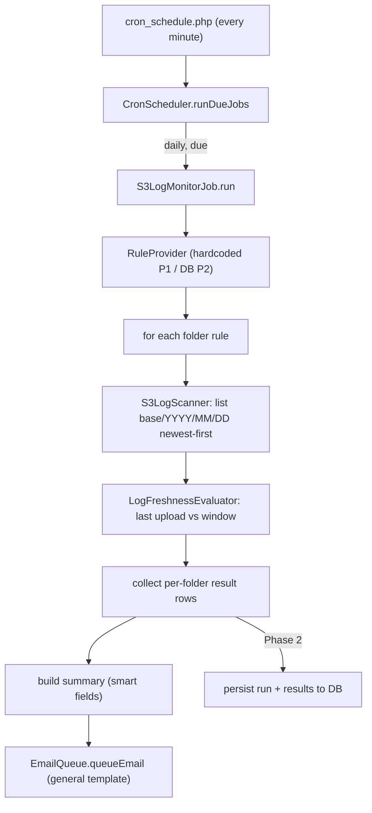

# S3 Log Freshness Monitor — Implementation Plan

## Context discovered in the codebase

- Cron framework is already in place. The system crontab calls `public/cron_schedule.php` every minute (CLI-only) which runs [catalog/controller/cron/schedule.php](public/catalog/controller/cron/schedule.php) -> `CronScheduler::runDueJobs()` ([system/library/cron/CronScheduler.php](public/system/library/cron/CronScheduler.php)).
- Jobs implement `CronJobInterface::run(CronContext): CronJobResult` ([system/library/cron/CronJobInterface.php](public/system/library/cron/CronJobInterface.php), [CronJobResult.php](public/system/library/cron/CronJobResult.php), [CronContext.php](public/system/library/cron/CronContext.php)). `CronContext` exposes `registry`, `log`, `db()`, `config()`.
- Each job is whitelisted in [system/config/cron_job_handlers.php](public/system/config/cron_job_handlers.php) and driven by a row in the `cron_scheduled_job` table ([catalog/model/cron/scheduled_job.php](public/catalog/model/cron/scheduled_job.php)). Schedule presets incl. `daily` with optional `run_at` ([system/library/cron/CronScheduleEvaluator.php](public/system/library/cron/CronScheduleEvaluator.php)). Overlap protection via `without_overlapping` + `CronJobLock`.
- Reference job patterns: [FreeForeverAnniversaryJob.php](public/system/library/cron/jobs/FreeForeverAnniversaryJob.php) and [TestRunnerCronJob.php](public/system/library/cron/jobs/TestRunnerCronJob.php).
- Email: queue into `mail_queue` via `EmailQueue::queueEmail()` ([system/library/emailQueue.php](public/system/library/emailQueue.php)); the queue is flushed by [catalog/controller/cronjobs/sendmail.php](public/catalog/controller/cronjobs/sendmail.php) through Mailgun. We will reuse the **`general template`** Mailgun template + language-prefix smart-field pattern exactly like [TestRunnerCronEmailNotifier.php](public/system/library/test/TestRunnerCronEmailNotifier.php).
- **No AWS SDK is installed.** Decision (confirmed): add `aws/aws-sdk-php` via Composer and use `S3Client::listObjectsV2`.
- DB conventions: models extend `Model`, use `$this->db->query` / `$this->db->escape` / `$this->db->getLastId`; PKs `*_id`, `date_added`/`date_modified` `NOW()`. Newer infra tables (e.g. `cron_scheduled_job`) are unprefixed; `mail_queue` uses `DB_PREFIX`. SQL is applied via `db/migrations/*.sql` files (referenced in [cron.dev.php.example](public/system/config/cron.dev.php.example)).

## High-level flow



---

# Phase 1 — Core logic with hardcoded configuration

### Cron schedule

- Register handler key `s3_log_monitor` in [system/config/cron_job_handlers.php](public/system/config/cron_job_handlers.php).
- Insert one `cron_scheduled_job` row: `job_key='s3_log_monitor'`, `schedule_preset='daily'`, `run_at` set to a fixed UTC time (e.g. `07:00`, to allow overnight uploads to land), `enabled=1`, `without_overlapping=1`. No new crontab line needed — the existing minute tick dispatches it.

### Module structure (new files under `system/library/s3logmonitor/`)

- `S3LogMonitorConfig.php` — hardcoded rules array (the single thing Phase 2 replaces):

```php
return [
  ['base_path' => 'dr/hsm/hsmdr',     'label' => 'HSM DR',     'window_days' => 7, 'grace_hours' => 0],
  ['base_path' => 'prod/ejbca/ejbca01','label' => 'EJBCA prod','window_days' => 1, 'grace_hours' => 0],
];
```

- `RuleProviderInterface.php` + `HardcodedRuleProvider.php` — returns normalized rule DTOs. (Phase 2 adds `DatabaseRuleProvider`.)
- `S3ClientFactory.php` — builds `Aws\S3\S3Client` from config/env (region, credentials, bucket).
- `S3LogScanner.php` — for a base path + lookback, returns `{ last_upload_date, last_modified, days_scanned }`. Takes the `S3Client` (or a thin interface) so it is mockable.
- `LogFreshnessEvaluator.php` — **pure** function: `(last_upload_date, rule, now) -> {status: pass|fail, reason}`. No I/O; reused unchanged in Phase 2.
- `S3LogMonitorReport.php` — turns result rows into smart-field values (incl. an HTML rows block injected via `{{...}}` placeholder in the `general template`).
- `S3LogMonitorEmailNotifier.php` — queues the summary email (mirror [TestRunnerCronEmailNotifier.php](public/system/library/test/TestRunnerCronEmailNotifier.php): `EmailQueue::queueEmail(null, $to, $langId, $smartFields, 'text_subject', 'general template', '', 's3_log_monitor_')`).
- `system/library/cron/jobs/S3LogMonitorJob.php` — implements `CronJobInterface`, orchestrates: load rules -> scan -> evaluate -> report -> email -> set `CronJobResult`.

### S3 folder scanning strategy

- One `S3Client` for the run. For each rule, compute the lookback = `max(window_days, MAX_LOOKBACK_CAP)` (cap, e.g. 30, to bound work when nothing is found).
- Iterate candidate days **newest-first** from "today" (in the configured timezone) backwards. For each day build the prefix `"<base_path>/<Y>/<m>/<d>/"` (zero-padded month/day, trailing slash) and call `listObjectsV2(Bucket, Prefix, MaxKeys=1)`.
- First day whose response has non-empty `Contents` = the **last upload date found**; stop scanning that folder. Optionally read the newest object's `LastModified` for display.
- If an optional `filename_pattern` is set, filter keys (request a few keys and regex-match) before counting a hit.

### Determining the date range from each rule

- `window_days = N` means "at least one log within the last N days". Pass if `last_upload_date >= today - (N-1) days` (timezone-aware), optionally extended by `grace_hours`.
- `dr/hsm/hsmdr` -> N=7; `prod/ejbca/ejbca01` -> N=1 (today, or today/yesterday if grace allows).

### Pass/fail production per folder

Each row: `base_path`, `label`, rule description (`<= N days`), `last_upload_date` (or "none found"), `status` (PASS/FAIL/ERROR), `reason` (e.g. "last upload 9 days ago, exceeds 7-day window" / "no logs in last 30 days" / "S3 error: <msg>").

### Email summary

- Build one email with a table of all folder rows; subject reflects overall status (e.g. `[OK]` vs `[ALERT] N folder(s) stale`). Sent via the queue; flushed by existing `sendmail` cron. Recipient(s) hardcoded in Phase 1 (constant/config).

### Logging & error handling

- Use a dedicated `Log('s3_log_monitor.log')` (like `TestRunnerCronLog`): log start, per-folder outcome, email queued/error, end summary.
- Wrap each folder scan in try/catch so one folder's S3 failure does not abort the others; mark that folder `ERROR`. If any folder is FAIL/ERROR, set `CronJobResult.ok = false` and populate `errors`.

### Edge cases

- **Missing/empty base or date folders**: S3 has no real folders; empty `Contents` simply means "no log that day" -> keep scanning back; FAIL if none within lookback.
- **S3 API failure / throttling**: catch per folder, status ERROR, include message; consider one retry with backoff.
- **Timezone**: day-path boundaries computed in a configurable timezone (default UTC); `LastModified` is UTC. Make tz explicit to avoid off-by-one at midnight.
- **Delayed uploads**: handled by `grace_hours` and by scheduling `run_at` after expected upload time.
- **Pagination**: `MaxKeys=1` per-day means no pagination needed for existence checks.

### Testing (Phase 1)

- Unit (`tests/unit`): `LogFreshnessEvaluator` with frozen "now" across pass/fail/grace/none-found boundaries; `S3LogScanner` against a **mocked** S3 client returning canned `listObjectsV2` results (no network); `S3LogMonitorReport` smart-field output.
- Feature/integration (`tests/feature`): full `S3LogMonitorJob` run with mocked S3 + asserting an email row is queued into `mail_queue`. Optional live smoke test against a real test bucket gated behind an env flag.

---

# Phase 2 — Database-driven configuration

### Proposed entities (unprefixed infra tables, mirroring `cron_scheduled_job`)

- **`s3_log_monitor_folder`**: `folder_id` PK, `base_path`, `label`, `bucket` (nullable override), `timezone`, `filename_pattern` (nullable), `detection_mode` (`object_exists` | `last_modified`), `enabled`, `date_added`, `date_modified`.
- **`s3_log_monitor_rule`**: `rule_id` PK, `folder_id` FK, `rule_type` (`max_age_days`), `window_days`, `grace_hours`, `active`, `effective_from`, `effective_to` (nullable), `date_added`, `date_modified`. (Separate table so rules can change over time with history.)
- **`s3_log_monitor_run`**: `run_id` PK, `started_at`, `finished_at`, `status`, `folders_checked`, `folders_passed`, `folders_failed`, `error`.
- **`s3_log_monitor_result`**: `result_id` PK, `run_id` FK, `folder_id` FK, `rule_snapshot` (JSON of rule used), `last_upload_date` (nullable), `status` (`pass`|`fail`|`error`), `reason`, `checked_at`.
- **`s3_log_monitor_recipient`**: `recipient_id` PK, `email`, `name`, `active`, `min_severity` (optional), `date_added`, `date_modified`.
- **`s3_log_monitor_alert`** (history): `alert_id` PK, `run_id` FK, `recipient_id` FK, `mail_queue_id`, `subject`, `sent_at`.

### Relationships

- `folder` 1.._ `rule`; `run` 1.._ `result`; `result` _..1 `folder`; `alert` _..1 `run` and \*..1 `recipient`; `recipient` list is global.

### Loading active rules

- New model `catalog/model/tool/s3_log_monitor.php` (`ModelToolS3LogMonitor`) with `getActiveFolderRules($now)` joining `folder.enabled=1` and `rule.active=1` where `effective_from <= now AND (effective_to IS NULL OR effective_to > now)`. Loaded in the job via `$registry->get('load')->model('tool/s3_log_monitor')`.

### Keeping validation reusable

- Job depends only on `RuleProviderInterface`. Add `DatabaseRuleProvider` that maps DB rows to the **same rule DTO** consumed by the unchanged `S3LogScanner` + `LogFreshnessEvaluator`. Switching config source = swapping the provider; core logic untouched.

### Storing results per run

- At run start insert a `s3_log_monitor_run`; per folder insert a `s3_log_monitor_result` (with `rule_snapshot`); at end update the run with counts/status.

### Multiple recipients

- Load active recipients; queue one email per recipient (queue is single-`to` per row) and record a `s3_log_monitor_alert` row per send capturing `mail_queue_id`.

### Enable/disable/update without code

- Admin CRUD controller + template under `admin/controller/tool/s3_log_monitor.php` (mirror [admin/controller/tool/cron_job.php]), wired to ACL route `tool/s3_log_monitor`. Toggle `folder.enabled`, `rule.active`, edit windows/recipients live.

### Handling rule changes over time

- Never hard-delete rules: set `active=0` / `effective_to`. New values create a new `rule` row with new `effective_from`. `result.rule_snapshot` preserves how each historical run was judged.

### Migration path P1 -> P2

1. Add `db/migrations/<date>_s3_log_monitor.sql` creating the six tables.
2. Seed `folder`/`rule`/`recipient` from the Phase 1 hardcoded config.
3. Add `DatabaseRuleProvider`; switch the job to it behind a config flag (`s3_log_monitor_source = db|hardcoded`), keeping hardcoded as fallback.
4. Enable result persistence + multi-recipient + admin CRUD; remove hardcoded provider once verified.

### Testing (Phase 2)

- Model tests: `getActiveFolderRules` respects `enabled`/`active`/effective window; provider maps to identical DTOs (evaluator/scanner tests stay green unchanged).
- Integration: full DB-driven run persists one `run` + N `result` rows and one `alert` per recipient; admin CRUD create/edit/toggle.

---

# Questions / Additional Information Needed

- **S3 bucket name(s) & AWS region** — single bucket for all base paths, or per-folder bucket? Region.
- **AWS credentials source** — IAM instance role, env vars, or a shared config file? (Drives `S3ClientFactory`.)
- **Exact log filename pattern** — any required pattern to filter on, or is any object in the day folder a valid "log"?
- **Detection method** — confirm: object existence under `base/YYYY/MM/DD/` (primary) vs additionally validating `LastModified` within the window?
- **Timezone for daily checks** — UTC, or `Europe/Bucharest`? Affects day-path boundaries and "last N days".
- **Recipient list** — Phase 1 hardcoded address(es)? Any escalation rules / severity routing?
- **Alert cadence** — alert every day until resolved, or suppress/deduplicate repeats (only on state change)?
- **Mailgun template** — confirm reuse of `general template`; we will add `s3_log_monitor_*` language entries (subject/body/rows) under `mail/mailgun`.
- **Composer availability** — OK to add `aws/aws-sdk-php` to the project's Composer deps (no SDK currently present)?
- **Deployment & migrations** — where do `db/migrations/*.sql` get applied (no committed migrations folder found)? Confirm process for the new tables in Phase 2.
- **Monitoring & retries** — desired retry count/backoff on S3 errors; should job failure itself page anyone beyond the summary email?
- **Lookback cap** — acceptable max days to scan back when no logs are found (default suggestion: 30)?
